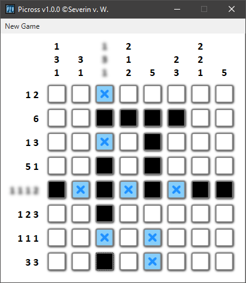
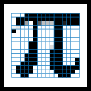
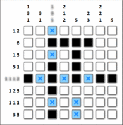

# Picross [](https://ci.appveyor.com/project/medusalix/Picross) [](https://github.com/medusalix/Picross/releases/latest)

<p align="center">
  
</p>

---



Picross is a logic puzzle game originally invented by Japanese puzzler [Tetsuya Nishio](https://en.wikipedia.org/wiki/Nonogram#History) and popularised by [Nintendo's](https://en.wikipedia.org/wiki/Nintendo) _**Pic**ture **Cross**word_ titles.
This project serves as an example of a simple Picross clone using standard **WPF components** and little custom styling.

## How to play



- Every row and column has to have a **certain amount of crosses**
- The **numerical hints** on each side indicate the number of **consecutive crosses** there have to be in each row/column
- Every group of crosses must be kept **separate from the subsequent sequence**
- The goal is to fill out the grid completely using the hints provided
- Crosses can be **placed using a left click**, fields can be **excluded by right clicking**
- Successive boxes can be marked by **holding the mouse button and dragging** across the grid

## License

Picross is released under the [Apache 2.0 license](LICENSE).

```
Copyright (C) 2019 Medusalix

Licensed under the Apache License, Version 2.0 (the "License");
you may not use this file except in compliance with the License.
You may obtain a copy of the License at

    http://www.apache.org/licenses/LICENSE-2.0

Unless required by applicable law or agreed to in writing, software
distributed under the License is distributed on an "AS IS" BASIS,
WITHOUT WARRANTIES OR CONDITIONS OF ANY KIND, either express or implied.
See the License for the specific language governing permissions and
limitations under the License.
```
